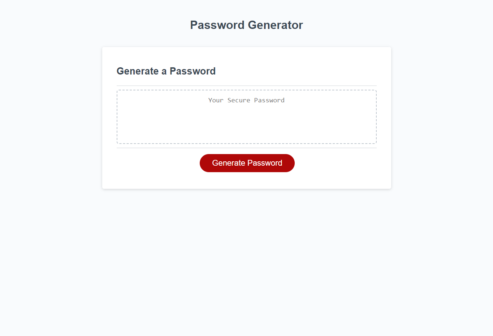

# Challenge-Third-Week

## Description
This is an application that generates a random password based on a number of selections chosen by the user.
The user is first prompted to designate a character length for the password between 8 and 128 characters.
The user is then prompted to either include or exclude a variety of character arrays.
These arrays are lowerscae characters, uppercase characters, numbers, and special characters.
Once the user has selected the length and type of characters to include a password matching their criteria is generated.

## Deployed
https://nickjerschow.github.io/Challenge-Third-Week/

## Usage

## Credits
Starter code provided by the course.
Layout and logical framework influenced by Paul Keldsen's tutorial guide.
https://www.youtube.com/watch?v=x4HUaiazDes